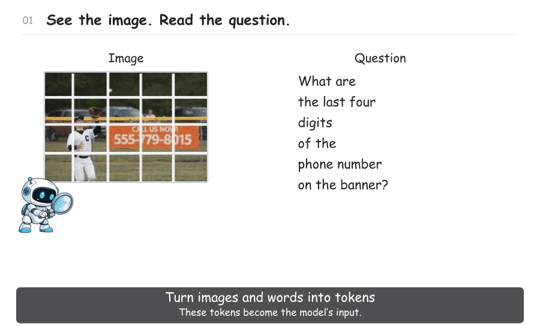

<div align="center">

<h1>
  
  <picture>
    <source media="(prefers-color-scheme: dark)" srcset="assets/realvr-wordmark-dark.svg">
    
  </picture>
</h1>

### Rethinking Latent Visual Reasoning<br>Grounding Latent Reasoning in Visual Evidence

*“Reasoning like humans. Grounded in what you see.”*

[](https://arxiv.org/abs/2609.34563)
[](https://xixiaouab.github.io/projects/ReaLVR/)
[](https://huggingface.co/MarkShaw99/ReaLVR)
[](LICENSE)

[Quick Start](#quick-start) · [Training](#training) · [Evaluation](#evaluation) · [Data](#data) · [Citation](#citation)

</div>

<p align="center">
  
</p>
<p align="center"><sub>From images and questions to latent reasoning grounded in visual evidence.</sub></p>

## Overview

**ReaLVR** grounds continuous latent reasoning in the visual evidence needed to answer a question.
It supervises the model’s own free-running latent trajectory, learning both **what evidence to preserve**
and **where to apply supervision** alongside the reinforcement learning objective.

| What to Preserve | Where to Supervise | At Inference |
| :--- | :--- | :--- |
| Contrast relevant and mismatched visual evidence. | Use correct and wrong answers to assign credit to latent tokens. | Keep the original architecture and inference procedure. |

> [!NOTE]
> Visual supervision is used during training only. Pretrained model weights are coming soon.

## Method

<details>
<summary><strong>One latent trajectory, two complementary contrasts</strong></summary>

| Step | What Happens |
| :--- | :--- |
| **Generate the trajectory** | Roll out a differentiable autoregressive latent span with the current model, before supplying answer tokens. |
| **Identify relevant evidence** | Contrast a relevant visual prototype with mismatched visual prototypes using a cosine margin. |
| **Assign latent credit** | Compare attention from correct and model-generated wrong answer readouts over the same latent span. |
| **Train with visual supervision** | Apply detached credit weights to the visual margin and backpropagate through latent generation. |

The two supervision branches are used during training only. The [project page](https://xixiaouab.github.io/projects/ReaLVR/) includes the method figures, benchmark results, and evidence sensitivity analysis.

</details>

## Quick Start

Python 3.11 · PyTorch 2.6 · Qwen2.5-VL · DeepSpeed ZeRO-3

```bash
git clone https://github.com/xixiaouab/ReaLVR-code.git
cd ReaLVR-code
conda create -n realvr python=3.11 -y
conda activate realvr
pip install -r requirements.txt
```

Prepare the [training data](#data), then run the two stages below. The launch scripts default to eight GPUs;
set `GPUS_PER_NODE` for your machine.

## Training

Both stages use DeepSpeed ZeRO-3 (`scripts/zero3.json`). Set `NNODES`, `NODE_RANK`, `MASTER_ADDR`
and `GPUS_PER_NODE` for multi-node runs.

### Stage 1 · Latent Visual SFT

Start from `Qwen/Qwen2.5-VL-7B-Instruct`:

```bash
MODEL=Qwen/Qwen2.5-VL-7B-Instruct DATA=data/stage1.json IMAGE_FOLDER=data/images \
OUTPUT=checkpoints/stage1 bash scripts/stage1_sft.sh
```

### Stage 2 · Evidence-Grounded GRPO

Continue from your Stage-1 checkpoint:

```bash
MODEL=checkpoints/stage1 DATA=data/stage2.json IMAGE_FOLDER=data/images \
OUTPUT=checkpoints/stage2 bash scripts/stage2_realvr.sh
```

<details>
<summary><strong>ReaLVR Training Parameters</strong></summary>

| Argument | Default | Meaning |
|---|---|---|
| `--lvr_steps` | 8 | latent length K (training and inference) |
| `--evidence_weight` | 0.2 | weight of the evidence loss (0 gives plain GRPO) |
| `--evidence_margin` | 0.5 | target cosine margin |
| `--credit_eta` | 0.3 | uniform share of the position weights |
| `--num_negatives` | 16 | negative prototypes per example |

</details>

## Evaluation

```bash
python -m eval.evaluate --checkpoint checkpoints/stage2 --benchmark mmvp \
    --data-dir data/benchmarks --output-dir results/mmvp
```

Supported benchmarks: `mmvp`, `blink`, `hrbench4k`, `hrbench8k`, `mme_realworld_lite`.

<details>
<summary><strong>Evaluation Options and Sharded Runs</strong></summary>

The expected layout of
`--data-dir` is listed in `python -m eval.evaluate --help`. By default each question gets one greedy
answer with K = 8 latent steps at the processor's image-size limit. `--max-pixels` changes that limit,
and `--num-samples N` samples N answers per question and selects one (`--selection`); the settings of
every run are written to its `summary.json`. `--start-index` and `--max-samples` split a benchmark into
shards; `python -m eval.merge_results` combines their summaries.

</details>

## Data

<details>
<summary><strong>Stage 1 · Visual Reconstruction Data</strong></summary>

A JSON list of LLaVA-style records with one box per `<lvr>` placeholder:

```json
{
  "image": "flickr30k/2618322793.jpg",
  "conversations": [
    {"from": "human", "value": "<image>\nWhat is the child on the swing wearing?"},
    {"from": "gpt", "value": "<lvr>\n<answer> Dark blue denim shorts. </answer>"}
  ],
  "bboxes": [[0.382, 0.456, 0.718, 0.656]]
}
```

Each `<lvr>` becomes `<|lvr_start|>`, one `<|lvr|>` per visual token inside its box, and
`<|lvr_end|>`; the model is trained to reconstruct those visual tokens. `--data_path` can also be a
JSON list of `{"ds_name", "data_path", "image_folder"}` entries to mix several datasets.

</details>

<details>
<summary><strong>Stage 2 · Question–Answer Data</strong></summary>

A JSON list of records:

```json
{
  "image": "relative/path.jpg",
  "conversations": [
    {"from": "human", "value": "<image>\nQuestion ... Options: A. ... B. ..."},
    {"from": "gpt", "value": "<answer>B</answer>"}
  ],
  "bboxes": [[0.2, 0.3, 0.8, 0.9]]
}
```

`bboxes` (pixels or normalized) mark the visual evidence; without it the whole image is used.
The paper uses a mixture of ViRL39K and Visual-CoT.

</details>

## Repository Structure

<details>
<summary><strong>Files and Entry Points</strong></summary>

| Path | Purpose |
| :--- | :--- |
| [`realvr/model/`](realvr/model/) | Qwen2.5-VL with latent token generation. |
| [`realvr/dataset/`](realvr/dataset/) | SFT and GRPO data loading. |
| [`realvr/trainer/evidence.py`](realvr/trainer/evidence.py) | Visual evidence loss and latent credit assignment. |
| [`realvr/trainer/`](realvr/trainer/) | Stage-1 SFT and Stage-2 GRPO trainers. |
| [`realvr/train/`](realvr/train/) | Training entry points and reward functions. |
| [`scripts/`](scripts/) | Launch scripts and DeepSpeed configuration. |
| [`eval/`](eval/) | Benchmark evaluation and shard merging. |
| [`tests/`](tests/) | Model, training, and evaluation checks. |
| [`assets/animation/`](assets/animation/) | Animation sources and GIF export scripts. |

</details>

<details>
<summary><strong>Running the Tests</strong></summary>

```bash
pip install pytest
pytest tests/
```

`tests/test_trainer.py` runs Stage-2 steps end to end on CPU with a tiny random model; it needs the
Qwen2.5-VL processor files locally (`REALVR_TEST_PROCESSOR=/path/to/Qwen2.5-VL-7B-Instruct`).

</details>

## Authors

Xi Xiao · Tianchen Zhao · Youngeun Kim · Zhuowei Li · Linghan Xu · Jiaye Wu · Zheng Zhang ·
Xiang Xu · Xuanbai Chen · Farhan Tejani · Jakub Zablocki · Julia Xu · Yifan Xing

**University of Alabama at Birmingham · Amazon AGI**

Work done during an internship at Amazon AGI.

Contact: [xxiao@uab.edu](mailto:xxiao@uab.edu) · [tianchz@amazon.com](mailto:tianchz@amazon.com)

## Citation

```bibtex
@misc{xiao2026realvr,
  title={Rethinking Latent Visual Reasoning: Grounding Latent Reasoning in Visual Evidence},
  author={Xiao, Xi and Zhao, Tianchen and Kim, Youngeun and Li, Zhuowei and Xu, Linghan and Wu, Jiaye and Zhang, Zheng and Xu, Xiang and Chen, Xuanbai and Tejani, Farhan and Zablocki, Jakub and Xu, Julia and Xing, Yifan},
  year={2026},
  eprint={2609.34563},
  archivePrefix={arXiv},
  primaryClass={cs.CV},
  url={https://arxiv.org/abs/2609.34563}
}
```

## Acknowledgements

This code builds on [Latent Visual Reasoning](https://github.com/VincentLeebang/lvr),
[Qwen2-VL-Finetune](https://github.com/2U1/Qwen2-VL-Finetune), [TRL](https://github.com/huggingface/trl)
and [InternVL](https://github.com/OpenGVLab/InternVL).

## License

Copyright (c) 2026 Xi Xiao and ReaLVR contributors.

Licensed under [CC BY-NC 4.0](LICENSE). Third-party components retain their original licenses;
see [THIRD_PARTY_NOTICES.md](THIRD_PARTY_NOTICES.md).
